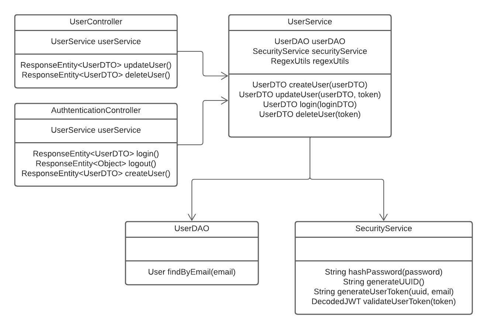

# USERS SERVICE


Esta aplicación te permite dar de alta usuarios, modificarlos y eliminarlos.


## Features

- Dar de alta usuarios
- Logearse y Deslogearse
- Estando logeado poder modficar o eliminar el usuario

## Instalación


Instalar dependencias

```sh
mvn clean install
```

Correr aplicación

```sh
mvn spring-boot:run
```

## Endpoints

### Create User

**Descripción** : `Creates a user with the given data`

**URL** : `/v1/authentication`

**Method** : `POST`

**Auth required** : NO

**Body example**

```json
{
    "name": "Juan Rodriguez",
    "email": "juan@rodriguez.org",
    "password": "hunter2hunter2",
    "phones": [
        {
            "number": "1234567",
            "citycode": "1",
            "countrycode": "57"
        }
    ]
}
```

### Login

**Descripción** : `Login`

**URL** : `/v1/authentication/login`

**Method** : `POST`

**Auth required** : NO

**Body example**

```json
{
    "email": "juan@rodriguez.org",
    "password": "hunter2hunter2"
}
```

### Logout

**Descripción** : `Logout`

**URL** : `/v1/authentication/logout`

**Method** : `POST`

**Auth required** : NO

### Update User

**Descripción** : `Actualiza el usuario que se encuentra loggeado`

**URL** : `/v1/users`

**Method** : `POST`

**Auth required** : SI

**Body example**

```json
{
    "name": "Juan Rodriguez",
    "email": "juan@rodriguez.org",
    "password": "hunter2hunter2",
    "phones": [
        {
            "number": "1234567",
            "citycode": "1",
            "countrycode": "57"
        }
    ]
}
```

### Delete User

**Descripción** : `Elimina el usuario que se encuentra loggeado`

**URL** : `/v1/users`

**Method** : `DELETE`

**Auth required** : SI

## Configuraciones

Se pueden modificar las siguientes configuraciones en el archivo application.yml

- regex: es la regex de validación de usuarios
- error: es el error que se mandará cuando la contraseña ingresada no es validada por la regex

Ejemplo:
```yaml
password:
  regex: .{10,}
  error: The password should contain at least 10 characters
```

## Diagrama de clases
